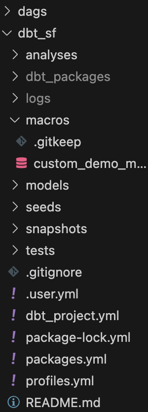

https://quickstarts.snowflake.com/guide/data_engineering_with_apache_airflow_ja/index.html?index=..%2F..index#2


## Required "name" field not present in project

> 最後のステップは、db_utilsのdbtモジュールをインストールすることです。dbtディレクトリから次を実行します。
> dbt deps


console output:
```
dbt deps
00:34:17  Running with dbt=1.7.14
00:34:17  Encountered an error:
Runtime Error
  Required "name" field not present in project
```

fix:dbt_project.yml
```
name: example
profile: default
models:
  my_new_project:
      # Applies to all files under models/example/
      transform:
          schema: transform
          materialized: view
      analysis:
          schema: analysis
          materialized: view
seed-paths: ["data"]   
```

## macrosフォルダの下

> ここで、macrosフォルダの下にcustom_demo_macros.sqlというファイルを作成し

> 関連するモジュールがdbt_modulesフォルダにインストールされていることがわかります。
> ここまでで、次のようなフォルダ構造になります。


note: `custom_demo_macros.sql`か`macro.sql`のどちらのファイル名にするか

fix: `custom_demo_macros.sql`に変更
画像修正



## airflowが起動しない

.envファイルを以下のようにする
```
_PIP_ADDITIONAL_REQUIREMENTS=dbt-snowflake==1.7.3
```