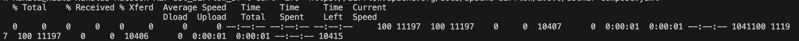
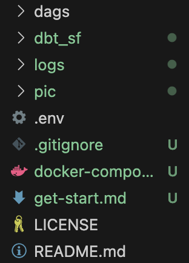
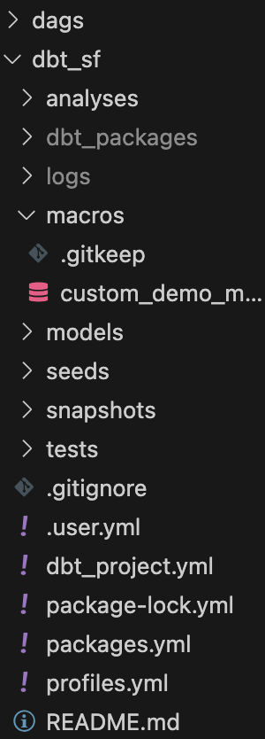
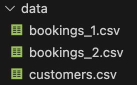
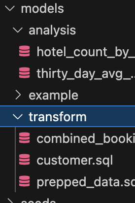

# 環境設定
ターミナルで以下のコマンドを実行して、Docker Composeファイルをダウンロードします。
```
curl -LfO 'https://airflow.apache.org/docs/apache-airflow/2.9.0/docker-compose.yaml'
```




docker-compose.yamlファイルを開き、以下の行を追加します。
```
  volumes:
    - ./dags:/opt/airflow/dags
    - ./logs:/opt/airflow/logs
    - ./plugins:/opt/airflow/plugins
    - ./dbt:/dbt # add this in
    - ./dags:/dags # add this in
```

.envファイルを作成し、以下の行を追加します。
```
echo "_PIP_ADDITIONAL_REQUIREMENTS=dbt==0.19.0" >> .env
echo ".env" >> .gitignore
```

```
brew update
brew tap dbt-labs/dbt
```


dbtが導入されているかどうかを確認するために、以下のコマンドを実行します。
```
dbt --version
```

以下のエラーが表示された場合、dbtがインストールされていないことを示しています。
```
zsh: command not found: dbt
```

以下のコマンドを実行して、dbtをインストールします。
```
# brew install dbt
brew update
brew install git
brew tap dbt-labs/dbt
brew install dbt-snowflake

# pip install dbt
python3 -m pip install dbt-core dbt-snowflake
```

dbtが正常にインストールされたかどうかを確認するために、以下のコマンドを実行します。
```
dbt init dbt_sf
```

ユーザ名、パスワード、ロール、ウェアハウス、データベース、スキーマを入力します。
```
23:57:11  Running with dbt=1.7.14
23:57:11  
Your new dbt project "dbt_sf" was created!

For more information on how to configure the profiles.yml file,
please consult the dbt documentation here:

  https://docs.getdbt.com/docs/configure-your-profile

One more thing:

Need help? Don't hesitate to reach out to us via GitHub issues or on Slack:

  https://community.getdbt.com/

Happy modeling!

23:57:11  Setting up your profile.
Which database would you like to use?
[1] snowflake

(Don't see the one you want? https://docs.getdbt.com/docs/available-adapters)

Enter a number: 1
account (https://<this_value>.snowflakecomputing.com): xxxx
user (dev username): xxxx@company.com
[1] password
[2] keypair
[3] sso
Desired authentication type option (enter a number): 1
password (dev password): 
role (dev role): SYSADMIN
warehouse (warehouse name): xxxx_WH
database (default database that dbt will build objects in): xxxx_DB
schema (default schema that dbt will build objects in): AIRFLOW_DBT
threads (1 or more) [1]: 1
23:59:58  Profile dbt_sf written to /Users/xxxx/.dbt/profiles.yml using target's profile_template.yml and your supplied values. Run 'dbt debug' to validate the connection.
```

```
mkdir dags
```
ツリーレポジトリは以下のようになります。




# DBTプロジェクトの設定

ブラウザからsnowflakeにアクセスし、以下のクエリを実行します。
```
user role SYSADMIN;
use database xxxx_DB;
create schema AIRFLOW_DBT;
```

スキーマが作成されたことが確認できます。


ローカルで以下のコマンドを実行して、DBTプロジェクトを作成します。


```
cd dbt_sf
vi profiles.yml
vi packages.yml
vi dbt_project.yml
vi macros/custom_demo_macros.sql
```

```profiles.yml
default:
  target: dev
  outputs:
    dev:
      type: snowflake
      ######## Please replace with your Snowflake account name 
      ######## for example sg_demo.ap-southeast-1
      account: "{{ env_var('dbt_account') }}"

      user: "{{ env_var('dbt_user') }}"
      ######## These environment variables dbt_user and dbt_password 
      ######## are read from the variabls in Airflow which we will set later
      password: "{{ env_var('dbt_password') }}"

      role: SYSADMIN
      database: "{{ env_var('dbt_database') }}"
      warehouse: "{{ env_var('dbt_warehouse') }}"
      schema: "{{ env_var('dbt_schema') }}"
      threads: 200
```


```packages.yml
packages:
  - package: fishtown-analytics/dbt_utils
    version: 0.6.4
```


```dbt_project.yml
name: example
profile: default
models:
  my_new_project:
      # Applies to all files under models/example/
      transform:
          schema: transform
          materialized: view
      analysis:
          schema: analysis
          materialized: view
seed-paths: ["data"]    
```

```custom_demo_macros.sql

    
    
        {{ default_schema }}
    
        {{ custom_schema_name | trim }}
    




   {# always use model name #}
  
    
    {{ log("Setting query_tag to '" ~ new_query_tag ~ "'. Will reset to '" ~ original_query_tag ~ "' after materialization.") }}
    
    {{ return(original_query_tag)}}
  
  {{ return(none)}}

```


ツリーレポジトリは以下のようになります。


# dbtでのCSVデータファイルの作成

csvを作成します。
```bookings_1.csv
id,booking_reference,hotel,booking_date,cost
1,232323231,Pan Pacific,2021-03-19,100
1,232323232,Fullerton,2021-03-20,200
1,232323233,Fullerton,2021-04-20,300
1,232323234,Jackson Square,2021-03-21,400
1,232323235,Mayflower,2021-06-20,500
1,232323236,Suncity,2021-03-19,600
1,232323237,Fullerton,2021-08-20,700
```

```bookings_2.csv
id,booking_reference,hotel,booking_date,cost
2,332323231,Fullerton,2021-03-19,100
2,332323232,Jackson Square,2021-03-20,300
2,332323233,Suncity,2021-03-20,300
2,332323234,Jackson Square,2021-03-21,300
2,332323235,Fullerton,2021-06-20,300
2,332323236,Suncity,2021-03-19,300
2,332323237,Berkly,2021-05-20,200
```

```customers.csv
id,first_name,last_name,birthdate,membership_no
1,jim,jone,1989-03-19,12334
2,adrian,lee,1990-03-10,12323
```




# modelsフォルダへのdbtモデルの作成

```
mkdir models/analysis
mkdir models/transform
vi models/analysis/hotel_count_by_day.sql
vi models/analysis/thirty_day_avg_cost.sql
vi models/transform/combined_bookings.sql
vi models/transform/customer.sql
vi models/transform/prepped_data.sql
```


```combined_bookings.sql
{{ dbt_utils.union_relations(
    relations=[ref('bookings_1'), ref('bookings_2')]
) }}
```

```customer.sql
SELECT ID 
    , FIRST_NAME
    , LAST_NAME
    , birthdate
FROM {{ ref('customers') }}
```


```prepped_data.sql
SELECT A.ID 
    , FIRST_NAME
    , LAST_NAME
    , birthdate
    , BOOKING_REFERENCE
    , HOTEL
    , BOOKING_DATE
    , COST
FROM {{ref('customer')}}  A
JOIN {{ref('combined_bookings')}} B
on A.ID = B.ID
```


```hotel_count_by_day.sql
SELECT
  BOOKING_DATE,
  HOTEL,
  COUNT(ID) as count_bookings
FROM {{ ref('prepped_data') }}
GROUP BY
  BOOKING_DATE,
  HOTEL
```


```thirty_day_avg_cost.sql
SELECT
  BOOKING_DATE,
  HOTEL,
  COST,
  AVG(COST) OVER (
    ORDER BY BOOKING_DATE ROWS BETWEEN 29 PRECEDING AND CURRENT ROW
  ) as "30_DAY_AVG_COST",
  COST -   AVG(COST) OVER (
    ORDER BY BOOKING_DATE ROWS BETWEEN 29 PRECEDING AND CURRENT ROW
  ) as "DIFF_BTW_ACTUAL_AVG"
FROM {{ ref('prepped_data') }}
```


